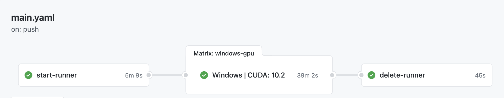

```{r setup, include=FALSE}
knitr::opts_chunk$set(echo = FALSE)
```

[GitHub Actions](https://github.com/features/actions) is a tool to automate CI/CD workflows. 
In the [torch for R](https://torch.mlverse.org) project besides the hosted runners 
offered by GitHub that allow us to test `torch` in all major platforms, we need to test our
code in GPU accelerated systems.

GitHub Actions doesn't offer GPU accelerated **hosted** runners but allows one
to easily add [*self-hosted* runners](https://docs.github.com/en/actions/hosting-your-own-runners/about-self-hosted-runners) to a repository. 

Adding a self-hosted runner to a repository is a relatively task when the machine
that is going to run the workflows is persistent, ie. the machine is turned on
most of the time expect for a few restarts or etc.

However GPU's are quite expensive and most cloud offerings charge ~$250 monthly
for a 24h - 7/7 machine equipped with an [NVIDIA Tesla K80](https://www.nvidia.com/en-gb/data-center/tesla-k80/) GPU. THis is not nice
specially because the instance would be idle for a large fraction of this period.

The ideal solution for us would be to spin up a GPU equipped ephemeral instance every time
we would like to run our workflow and turn it off once it's finished.
If we were to do it on Linux there are a few posts that help configuring ephemeral self-hosted runners for GitHub Actions. Specifically, [this series](https://dev.to/wayofthepie/ephemeral-self-hosted-github-actions-runners-1h5m) by Stephen O'Brien is great. Docker and nvidia-docker helps a lot here!

On Windows though, [there's no support](https://github.com/NVIDIA/nvidia-docker/issues/665) for nvidia-docker, so we had to build another custom solution.

## Overview



Our *workflow* will have 3 chained *jobs* that will do the following:

1. Create virtual machines on Google Cloud Platform, install the Github Actions runner and register them trough the GH Actions API.
2. The machines that were created in step .1 will take on the CI jobs. Eg running R CMD CHECK. This can possibly be a matrix of jobs.
3. Delete the VM instances and unregister the runners from HJ Actions.

## 1. Creating runners

First step to create the runners was to create a machine image with basic software pre-installed - this is similar to what GH Actions has for the hosted runners [here](https://github.com/actions/virtual-environments).

To do this we first created a VM instance in Google Cloud and manually installed the CUDA toolkit versions, CUDNN libraries,  CMake, Visual Studio Community (for the vsc compiler) and Git.

Once you have manually installed everything you can create the machine image. I used the web UI of google cloud console, mostly following [this tutorial](https://cloud.google.com/compute/docs/machine-images/create-machine-images). It's basically selecting the source VM (the one we already installed the basic software) and giving a name to the machine image. In my case it was "cuda-v1" or something like that.

Now that we have the machine image we can create the 'start-runners' job in the GitHub workflow `.yaml` file.

The full job description looks like this and we describe each step in code comments:

```yaml
start-runner:
    runs-on: ubuntu-18.04
    steps:
    
    # Installs the gcloud SDK and set's up the creadentials
    # We are are going to use the SDK to create the VM instances.
    - name: Set up Cloud SDK
      uses: google-github-actions/setup-gcloud@master
      with:
        project_id: ${{ secrets.GCP_PROJECT_ID }}
        service_account_key: ${{ secrets.GCP_APPLICATION_CREDENTIALS }}
        export_default_credentials: true
    
    # Creates the token used to register a new self-hosted runner via
    # the GH actions API.
    - name: Create registration token
      uses: actions/github-script@v3
      id: token
      with:
        github-token: ${{secrets.GH_TOKEN}}
        result-encoding: string
        script: |
          const result = await github.actions.createRegistrationTokenForRepo({
            owner: 'mlverse',
            repo: 'torch'
          });
          console.log(result)
          return result.data.token
          
    # In this step we create an startup script that is run once
    # when the VM instance is created.
    # The startup script we create here is responsible for downloading
    # and installing the actions runner system and registering it.
    # This script will create a runner with a label 'run-${{ github.run_number}}'.
    # We are going to use this information to select the runner that will be used
    # for runnig the tests in step 2.
    # We used Power Shell (.ps1) script but it could also be a `.bat` file.
    - name: Create the startup script
      run: |
        touch s.ps
        echo "mkdir C:\actions-runner; cd C:\actions-runner" >> s.ps
        echo "Invoke-WebRequest -Uri https://github.com/actions/runner/releases/download/v2.277.1/actions-runner-win-x64-2.277.1.zip -OutFile actions-runner-win-x64-2.277.1.zip" >> s.ps
        echo 'Add-Type -AssemblyName System.IO.Compression.FileSystem ; [System.IO.Compression.ZipFile]::ExtractToDirectory("$PWD/actions-runner-win-x64-2.277.1.zip", "$PWD")' >> s.ps
        echo "./config.cmd --url https://github.com/mlverse/torch --token ${{ steps.token.outputs.result }} --name 'runner-${{ github.run_number }}' --labels 'run-${{ github.run_number}}' --unattended" >> s.ps
        echo 'Start-Process -FilePath "./run.cmd"' >> s.ps
        
    # Now we can create the VM instance on GCP using the `gcloud` SDK
    # that we already installed.
    # The `source-machine-image` parameter describes which machine
    # will be used for the VM you create. You should pass the same
    # name as you used when you created the machine image.
    # The `metadata-from-file` parameter is telling gcloud to copy
    # the startup scrip we just created and ru it when the machine starts.
    # Other parameters are related to the resources you want your machine
    # to have. In our case we used a n1-standard-8 machine equipped with a
    # NVIDIA Tesla K80 GPU.
    - name: Create instance
      run: | 
        gcloud components install beta --quiet
        gcloud beta compute --project=rstudio-cloudml instances create runner-${{github.run_number}} \
          --zone=us-central1-a \
          --machine-type=n1-standard-8 \
          --accelerator=type=nvidia-tesla-k80,count=1 \
          --source-machine-image cuda-v8 \
          --network-interface network=default \
          --metadata-from-file windows-startup-script-ps1=s.ps
    # It might take some time for the startup script to run and we want
    # to wait for a couple of minutes before starting the next job, because it
    # requires that the self-hosted runner is already registered.
    - name: Wait for runner registration
      run: |
        sleep 2m 30s
```

## 2. Running the tests

This job is where we actually define what we want to run in the VM we just created and registered.

We just want to run R CMD CHECK in our package to make sure everything works on NVIDIA GPU's on Windows. 

The workflow description is pretty much the same as the one we use in the hosted runner, however we condition the `run-on` so this job runs in the runner we just created.

The job looks like the chunk below. Comments in the important parts.

```yaml
windows-gpu:
    # this is important so this job only runs after a successful run of the 
    # `start-runner` job
    needs: ['start-runner']
    strategy:
      fail-fast: false
      matrix:
        r_version: ["release"]
        cuda: ["11.1"]

    # Here we tell GH actions to run this job in a runner labeled 
    # 'run-${{ github.run_number}}' which is exactly the runner we
    # created and registered in step 1.
    # Everything below here is identical to the job we run on the
    # GH Actions hosted runner.
    runs-on: [self-hosted, windows, 'run-${{ github.run_number}}']
    
    name: 'Windows | CUDA: ${{ matrix.cuda }}'
    timeout-minutes: 120
    env:
      R_REMOTES_NO_ERRORS_FROM_WARNINGS: true
      INSTALL_TORCH: 1
      TORCH_LOG: 2
      TORCH_TEST: 1
      TORCH_INSTALL: 1
      CUDA: ${{ matrix.cuda }}
      
    steps:
      - uses: actions/checkout@v2
      - uses: r-lib/actions/setup-r@master
        with:
          r-version: ${{ matrix.r_version }}
      - uses: r-lib/actions/setup-pandoc@master
      - name: Install dependencies
        run: | 
          Rscript -e "options(repos=structure(c(CRAN='https://cloud.r-project.org/'))); install.packages(c('remotes', 'rcmdcheck', 'fs'))" -e "remotes::install_deps(dependencies = TRUE)"
      - name: Build lantern and get libtorch
        if: contains( github.event.pull_request.labels.*.name, 'lantern')
        run: | 
          Rscript tools/buildlantern.R
      - name: Check
        run:  |
          withr::with_makevars(list(MAKEFLAGS="-j8"), {
            rcmdcheck::rcmdcheck(args = c("--no-multiarch", "--no-manual"), error_on = "error", check_dir = "check")
          })
        shell: Rscript {0}
```

## 3. Clean up resources

This step runs after the test job runs and is responsible for correctly cleaning up the resources, ie. deleting the VM instance on google cloud and removing the runner in GH Actions UI.

We do this using the following job:

```yaml
delete-runner:
    # This if statement is important so this jobs runs even if the testing fails.
    # By default, GH Actions would skip it if the testing failed.
    if: ${{ success() || failure() || cancelled() }}
    # This defines that this job will run after the testing job and after the job
    # that creates the instances.
    needs: ['windows-gpu', 'start-runner'] 
    runs-on: ubuntu-18.04
    steps:
    # Again we setup gcloud
    - name: Set up Cloud SDK
      uses: google-github-actions/setup-gcloud@master
      with:
        project_id: ${{ secrets.GCP_PROJECT_ID }}
        service_account_key: ${{ secrets.GCP_APPLICATION_CREDENTIALS }}
        export_default_credentials: true
    # This used the the gcloud CLI to delete the instance with name that we
    # gave in the startup script.
    - name: Delete runner instance
      run: |
        gcloud compute --project=rstudio-cloudml instances delete runner-${{github.run_number}} --zone=us-central1-a
    # This removes the runner from the GH self-hosted registry.
    # This is not strictly necessary as GH actions seems to delete unreachable
    # runners after some time but looks like good practice.
    - name: Delete runner from GH
      uses: actions/github-script@v3
      id: token
      with:
        github-token: ${{secrets.GH_TOKEN}}
        result-encoding: string
        script: |
          const runners = await github.actions.listSelfHostedRunnersForRepo({
            owner: 'mlverse',
            repo: 'torch'
          });
          
          const runner_id = runners.data.runners.filter((runner) => {
            return runner.name === 'runner-${{ github.run_number }}';
          })[0].id
          
          await github.actions.deleteSelfHostedRunnerFromRepo({
            owner: 'mlverse',
            repo: 'torch',
            runner_id: runner_id
          });
```

## Fim

In this post we described our approach for self-hosted runners with GPU's on Windows.
It's not trivial and this post is far from being detailed. Feel free to reach out
if you have other questions or if we can help with anything. The full workflow is
[here](https://github.com/mlverse/torch/blob/f7aa1cd875b211369809cb9da9fdece16230ae9a/.github/workflows/main.yaml#L104-L227).
