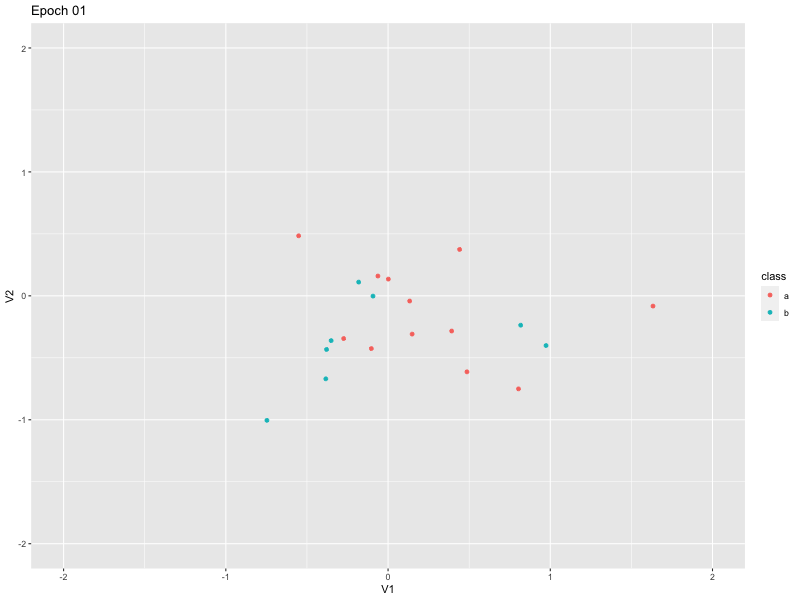

```{r setup, include=FALSE}
knitr::opts_chunk$set(echo = TRUE)
```

The [cosine embedding loss](https://torch.mlverse.org/docs/reference/nn_cosine_embedding_loss.html) in torch is given by:

$$\text{loss}(x, y) =
        \begin{cases}
        1 - \cos(x_1, x_2), & \text{if } y = 1 \\
        \max(0, \cos(x_1, x_2) - \text{margin}), & \text{if } y = -1
        \end{cases}$$
        
The idea is to give it a pair of vectors and and a response value $1$ or $-1$ depending on if they belong to the same group or not.

First let's generate small dataset of 20 observations, each one being a length 100 vector. We also sample for each obs if it belongs to group 'a' or group 'b':

```{r}
library(torch)
library(ggplot2) # going to use for plotting
x <- torch_randn(20, 100)
y <- sample(c("a", "b"), replace = TRUE, size = x$shape[1])
```

Next, we crate a torch dataset that will do the following everytime
we ask for a new item $i$:

1. Take the observation corresponding to the item $i$ in the dataset we created previously.
2. With $prob=0.5$ select an observation from the same group to be it's pair, otherwise select an observation from a different group.
3. Return both selected observations and the objective value $-1$ of they are obs are not from the same group and $1$ if they are.

```{r}
data <- dataset(
  initialize = function(x, y, rate = 0.5) {
    self$x <- x
    self$y <- y
    self$rate <- rate
  },
  .getitem = function(i) {
    
    lab <- self$y[i]
    if (self$rate < runif(1)) {
      i_ <- sample(which(self$y == lab), 1)
      obj <- 1
    } else {
      i_ <- sample(which(self$y != lab), 1)
      obj <- -1
    }
    
    list(x = self$x[i,], x_ = self$x[i_,], obj = obj)
  },
  .length = function() {
    x$shape[1]
  }
)

# Initialize the dataset and dataloaders
d <- data(x, y)
dl <- dataloader(d, batch_size = 5)
```

The model we are going to define is a dimension reduction model. It will take the observation space from 100 dimensions to only 2: $\mathbb{R}_{100} \Rightarrow \mathbb{R}_2$. It does that via linear model.

```{r}
model <- nn_linear(100, 2)
```

We create a plotting utility to plot observations in the model space.

```{r}
make_plot <- function(model, x, y) {
  with_no_grad({
    as <- as.data.frame(as.matrix(model(x[y == "a", ])))
    as$class <- "a"
    bs <- as.data.frame(as.matrix(model(x[y == "b", ])))
    bs$class <- "b"  
  })
  
  ggplot(rbind(as, bs), aes(x = V1, y = V2, color = class)) +
    geom_point() +
    xlim(-2, 2) +
    ylim(-2, 2)
}
```

We now fit this model for 100 epochs saving intermediary plots:

```{r}
opt <- optim_adam(model$parameters)
criterion <- nn_cosine_embedding_loss()

plots <- list()
for (epoch in 1:100) {
  coro::loop(for (b in dl) {
    r <- model(b$x)
    r_ <- model(b$x_)
    
    opt$zero_grad()
    loss <- criterion(r, r_, b$obj)
    loss$backward()
    opt$step()
    
  })
  plots[[length(plots) + 1]] <- make_plot(model, x, y)
}
```


And we can finally observe how the observations evolve in the model space during training:

```{r}
gifski::save_gif(delay = 0.1, lapply(seq_along(plots), function(x) {
  p <- plots[[x]] +
    ggtitle(label = sprintf("Epoch %02d", x))
  print(p)
}), "animation.gif")
```




