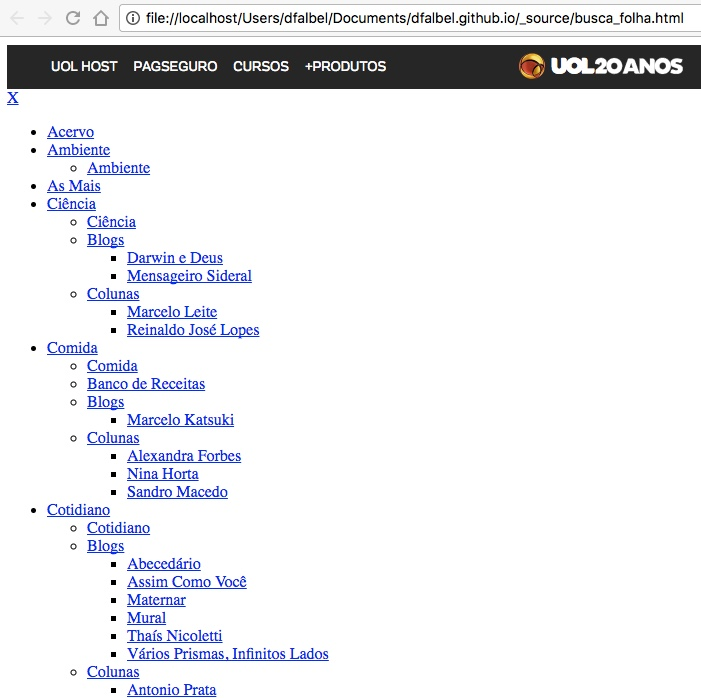

---
layout: post
title: 'Webscraping com R'
date : 2016-12-19
tags: [r]
--- 

# Introdução

Webscarping é uma técnica utilizada para obter dados provenientes de sites da
internet. Usa-se webscraping quando é necessário obter informações que não estão 
disponíveis em um banco de dados público, mas que podem ser obtidas por meio de uma
página da web. 

Geralmente páginas da internet podem ser considerados dados semi-estruturados, ou seja,
esses dados possuem uma estrutura relativamente bem definida, no entanto a estrutura é longe 
de ser a ideal para fazer análises. Webscraping transforma essa informação semi-estruturada
em informações que podem ser consideradas estruturadas.

Para aprender a fazer webscrapping é necessário entender um pouco do protocolo
HTTP e como funcionam requisições desse tipo e também a estrutura de arquivos html
e sua relação com arquivos css.

Neste post vamos falar sobre webscraping separando nessas duas partes:

- Como obter a página web (baixar)
- Como obter os dados que estão na página web obtida (raspagem)

Com o que falaremos aqui, será possível fazer webscrapping de grande parte dos sites
da internet, no entanto, não trataremos aqui de webscraping de sites que possuem 
muitas informações carregadas em *client-side* via javascript pois, neste caso, 
a abordagem precisa ser mais complexa, as vezes envolvendo a emulação de um browser.

# Requisições HTTP

HTTP como é abreviado o Hypertext Transfer Protocol, é a base para a comunicação
por meio da Internet. O HTTP funciona basicamente da seguinte forma: o cliente 
envia uma mensagem e o servidor envia uma resposta. Essa mensagem possui um cabeçalho (header)
e um corpo. O HTTP possui 8 métodos que determinam o que o servidor faz com o URL
fornecido. A maioria dos sites utiliza apenas `GET` ou `POST`.

O `GET` é o mais simples deles. Geralmente, essas requisições não possuem corpo,
e a respota é um arquivo `.html`. No R, uma requisição GET, pode ser realizada
usando a função `GET` do pacote `httr`.

```{r}
library(httr)
res <- GET("https://pt.wikipedia.org/wiki/Hypertext_Transfer_Protocol")
```

Na Wikipedia, por exemplo, o nome da página que você deseja acessar é passado como
parte do URL, como acima, queremos consultar a página sobre HTTP e passamos o 
nome desta página logo após a barra. Esse padrão se repete em muitos sites. 

Veja por exemplo uma busca no site da Folha de São Paulo. Vamos usar a opção de
salvar o arquivo no disco. Dessa forma, você poderá abrir o arquivo html gerado 
no seu próprio browser.

```{r}
res <- GET("http://search.folha.uol.com.br/?q=busca", write_disk("busca_folha.html"))
```

Se você abrir no browser, obterá um resultado parecido com esse.



Você notará que a aparência é diferente de quando você abre pelo URL direto.
Isso acontece porque quando você acessa um site pelo seu browser, ele não faz apenas
uma requisição. Geralmente, ele faz dezenas de requisições, entre elas ele estará
buscando os arquivos de estilo, responsáveis por customizar a aparência dos sites. 
Mas, tudo bem, para fazer webscraping, você só precisa da estrutura.


